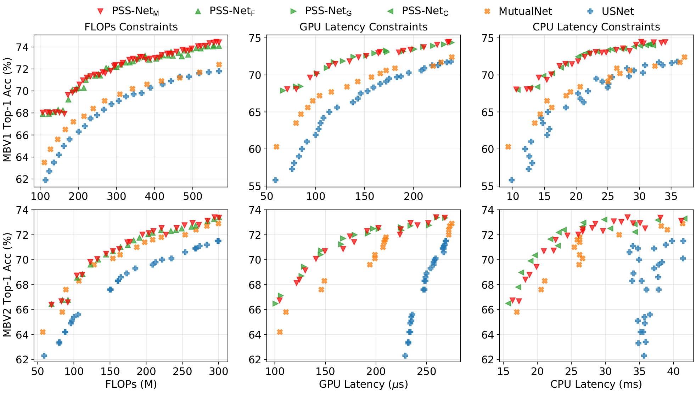

# Prioritized Subnet Sampling for Resource-Adaptive Supernet Training ([paper](https://arxiv.org/abs/2109.05432)) 

## Tips

Any problem, please contact the first author (Email: bhchen@stu.xmu.edu.cn).


## Dependencies

* Python 3.8
* Pytorch 1.7

## Supernet Training

1. Prepare your ImageNet dataset
2. Run training script

The training scripts are located in the `./scripts/train` directory.

```bash
./scripts/train/
├── pss-mbv1-f.sh	# train PSS-MBV1 under FLOPS Constraint
├── pss-mbv1-c.sh	# train PSS-MBV1 under CPU Latency Constraint
├── pss-mbv1-g.sh	# train PSS-MBV1 under GPU Latency Constraint
├── pss-mbv1-m.sh	# train PSS-MBV1 under FLOPS / CPU Latency / GPU Latency Constraint
├── pss-mbv2-f.sh	# train PSS-MBV2 under FLOPs Constraint
├── pss-mbv2-c.sh	# train PSS-MBV2 under CPU Latency Constraint
├── pss-mbv2-g.sh	# train PSS-MBV2 under GPU Latency Constraint
└── pss-mbv2-m.sh	# train PSS-MBV2 under FLOPS / CPU Latency / GPU Latency Constraint
```

## Evaluate Our Result

1. Prepare your ImageNet dataset
2. Download PSS-Net checkpoint from the link in the table below
3. Run evaluation script

The evaluation scripts are located in the `./scripts/test` directory.

```bash
./scripts/test/
├── pss-mbv1-f.sh	# evaluate PSS-MBV1 under FLOPS Constraint
├── pss-mbv1-c.sh	# evaluate PSS-MBV1 under CPU Latency Constraint
├── pss-mbv1-g.sh	# evaluate PSS-MBV1 under GPU Latency Constraint
├── pss-mbv1-m.sh	# evaluate PSS-MBV1 under FLOPS / CPU Latency / GPU Latency Constraint
├── pss-mbv2-f.sh	# evaluate PSS-MBV2 under FLOPs Constraint
├── pss-mbv2-c.sh	# evaluate PSS-MBV2 under CPU Latency Constraint
├── pss-mbv2-g.sh	# evaluate PSS-MBV2 under GPU Latency Constraint
└── pss-mbv2-m.sh	# evaluate PSS-MBV2 under FLOPS / CPU Latency / GPU Latency Constraint
```

## ImageNet Results

### Our Trained Supernets and Typical Subnets Reported  in the Paper

| SuperNet Link                                                | Constraint Type | Subnet1          | Subnet2           | Subnet3          | Subnet4          | Subnet5          | Subnet6          | Subnet7          | Subnet8          | Subnet9          | Subnet10         | ...  |
| ------------------------------------------------------------ | --------------- | ---------------- | ----------------- | ---------------- | ---------------- | ---------------- | ---------------- | ---------------- | ---------------- | ---------------- | ---------------- | ---- |
| [PSS-MBV1-F](https://drive.google.com/drive/folders/14QSRDhago2Y2MwHCBccWPZEQXeXfLEbc?usp=sharing) | FLOPs           | 555M<br />74.2%  | 496M<br />73.8%   | 443M<br />73.6%  | 375M<br />73.2%  | 343M<br />72.7%  | 310M<br/>72.4%   | 306M<br/>72.3%   | 273M<br/>72.1%   | 126M<br/>68.1%   | 107M<br/>67.9%   | ...  |
| [PSS-MBV1-G](https://drive.google.com/drive/folders/17UMz6jiRiv9PX4qTOk5KFNvL84KNf6Qo?usp=sharing) | GPU Latency     | 238us<br />74.4% | 220us<br />73.92% | 201us<br />73.5% | 172us<br />73.3% | 148us<br />72.6% | 128us<br />71.9% | 111us<br />70.9% | 94us<br />69.8%  | 76us<br />68.1%  | 67us<br />67.9%  | ...  |
| [PSS-MBV1-C](https://drive.google.com/drive/folders/1RpxpWFeKD__G71F5UQmINHx7Ny7eAzpE?usp=sharing) | CPU Latency     | 32ms<br />74.2%  | 30ms<br />73.9%   | 28ms<br />73.6%  | 26ms<br />73.5   | 23ms<br />73.2%  | 20ms<br />72.5%  | 18ms<br />71.5%  | 16ms<br />70.2%  | 13ms<br />68.3%  | 11ms<br />68.0%  | ...  |
| [PSS-MBV1-M](https://drive.google.com/drive/folders/1FQZmu68DlI3BF6KglzqDaBQSJyjWLr74?usp=sharing) | FLOPs           | 562M<br />74.5%  | 511M<br />74.1%   | 458M<br />73.6%  | 419M<br />73.3%  | 360M<br />73.1%  | 309M<br />73.5%  | 273M<br />72.1%  | 203M<br />70.6%  | 118M<br />68.1%  | 107M<br />68.0%  | ...  |
|                                                              | GPU Latency     | 236us<br />74.5% | 221us<br />74.1%  | 197us<br />73.4% | 166us<br />73.1% | 141us<br />72.4% | 120us<br />71.5% | 100us<br />70.0% | 88us<br />68.8%  | 71us<br />68.1%  | 69us<br />68.0%  | ...  |
|                                                              | CPU Latency     | 30ms<br />74.5%  | 28ms<br />73.8%   | 26ms<br />73.4%  | 23ms<br />73.1%  | 21ms<br />72.5%  | 18ms<br />71.5%  | 16ms<br />70.8%  | 14ms<br />69.6%  | 13ms<br />68.6%  | 11ms<br />68.0%  | ...  |
| [PSS-MBV2-F](https://drive.google.com/drive/folders/1FYlPDXznkoEJIrmprKnk0tSEyFQ3I6-D?usp=sharing) | FLOPs           | 301M<br />73.4%  | 294M<br />73.3%   | 277M<br />72.8%  | 241M<br />72.4%  | 203M<br />72.1%  | 163M<br />70.9%  | 154M<br />70.7%  | 134M<br />70.0%  | 84M<br />66.8%   | 69M<br />66.4%   | ...  |
| [PSS-MBV2-G](https://drive.google.com/drive/folders/1wVQ0NuapW-M_nUcsqiSTl0wEcm_z2QM4?usp=sharing) | GPU Latency     | 260us<br />73.4% | 252us<br />72.8%  | 234us<br />72.7% | 225us<br />72.6% | 197us<br />72.5% | 179us<br />72.0% | 165us<br />71.0% | 145us<br />70.4% | 126us<br />68.7% | 101us<br />66.5% | ...  |
| [PSS-MBV2-C](https://drive.google.com/drive/folders/1t98KCt3xjt-0SqH44E1Ys_U2gF0qTVKQ?usp=sharing) | CPU Latency     | 42ms<br />73.3%  | 30ms<br />73.2%   | 27ms<br />73.0%  | 25ms<br />72.5%  | 23ms<br />72.2%  | 21ms<br />71.0%  | 19ms<br />70.3%  | 18ms<br />69.5%  | 17ms<br />69.0%  | 16ms<br />66.7%  | ...  |
| [PSS-MBV2-M](https://drive.google.com/drive/folders/1UtAICQgBAXo21KhfqOQB22a0m3ed8nEh?usp=sharing) | FLOPs           | 301M<br />73.4%  | 295M<br />73.4%   | 249M<br />72.7%  | 192M<br />71.9%  | 163M<br />70.9%  | 154M<br />70.7%  | 132M<br />70.0%  | 104M<br />68.7%  | 83M<br />66.7%   | 69M<br />66.4%   | ...  |
|                                                              | GPU Latency     | 260us<br />73.4% | 226us<br />72.9%  | 202us<br />72.5% | 197us<br />72.4% | 174us<br />71.9% | 150us<br />70.7% | 139us<br />70.0% | 121us<br />67.5% | 102us<br />66.7% | 101us<br />66.4% | ...  |
|                                                              | CPU Latency     | 33ms<br />73.4%  | 32ms<br />73.2%   | 31ms<br />73.1%  | 29ms<br />72.9%  | 27ms<br />72.4%  | 24ms<br />72.2%  | 22ms<br />70.7%  | 20ms<br />69.4%  | 18ms<br />68.4%  | 16ms<br />66.6%  | ...  |

We only list the results of some subnets of the supernet, if you want to get the results of all subnets in the supernet, you can check the training logs or download the supernet weights for evaluation by using the links in the first column of the table.




Running the following command to get the above figure:

```bash
python ./scripts/plot_main_result.py
```


